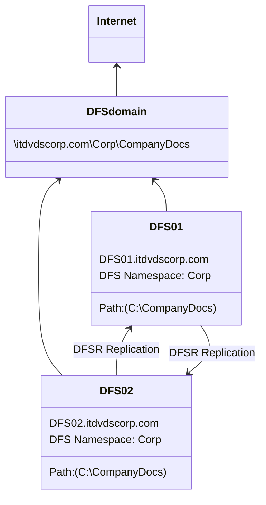

# Section 01 - Setting Up Share Drives


## Creating Folder and Setting Up Share Drive by `MSFT`
To create a share drive that include the domain in the share drive path, you need to follow these steps:

1. Create a folder that is going to be the share drive.

2. Right-click on the folder and select **"Properties"** from the context menu.

3. Click on the **"Sharing"** tab in the **"Properties"** window.

4. Click the **"Advanced Sharing"** button.

5. Check the box next to **"Share this folder"** to enable sharing.

6. Enter a new share if needed.

7. Click the **"Permissions"** button.

8. Click the **"Add"** button to add the domain user or group that you want to grant access to the folder.

9. Click the **"Object Types"** button.

10. Check the **"Groups"** box and click **"OK"**.

11. Enter domain name followed by backslash () and the group name, for example, `DOMAIN\Group`, in the **"Enter the object names to select"** field.

12. Click **"Check Names"** to verify the enter domain group name.

13. Click **"OK"** to add the domain group to the share permissions list.

14. In the **"Permissions"** window, select the domain group you just added.

15. Choose the access level you want to grant to the selected domain group, such as **"Read"** or **"Full Control"**.

16. Click **"OK"** to apply the changes and close the **"Permissions"** window.

17. Click **"OK"** to apply the changes and close the **"Advanced Sharing"** window.

18. Close the **"Properties"** window.

The share drive path will now include the domain when accessed by the domain users, for example, `\DOMAIN\ShareName`.


## Mapping Network Drive using Group Policy Preferences by `MSFT`
First of all, we need to create one **GPO**, and then we will define the settings. And after that, we will link that **GPO** to our **"HR" OU**.

Open **"Server Manage"** -> **"Tools"** (top right menu) -> **"Group Policy Management"** ->

On the ***left pane*** of the **Group Policy Managment MMC**, expand `mylab.local` -> expand **"Group Policy Objects"** -> 

-> right-click the same **"Group Policy Objects"** -> **"New"** ->

On the **"New GPO"** window, enter **"Map Network Drive Using Group Policy preference GPO"** to **"Name:"** field -> **"OK"**

The **GPO** should be created sucessfully under **"Group Policy Object" container**. Now we need to define the setting as well, so let's click on **"Map Network Drive Using Group Policy preference GPO"** -> right-click on the same item -> **"Edit..."**

On the ***left pane*** of the **"Group Policy Management Editor" MMC**, click on **"User Configuration"** -> 

-> expand **"Preferences"** -> expand **"Windows Settings"** -> **"Drive Maps"** ->

-> right-click on the same item -> **"New"** -> **"Mapped Drive"** ->

On the **"General"** tab of **"New Drive Properties"** window, under the **"Action:"** field, select **"Create"** becasue we're going to create a new map drive. Under the **"Location:"** field, we need to specify the path of our share folder, in our case, `\\WS2K19-DC01\HRSharedData`. Under the **"Label as:"** field, enter **"TEST"**. Under the **"Drive Letter"** section, select the drive letter **"M"** ->

Click on **"Common"** tab of **"New Drive Properties"** window, check the second checkbox that next to **"Run in logged-on user's security context (user policy option)"** ->

-> check the last checkbox that next to **"Item-level targeting"** -> **"Targeting..."** button ->

On the **"Targeting Editor"** window, click on **"New Item"**, here we have plenty of options. For the demonstration, we're going to use **"Security Group"** as a setting to define **Item-level targeting**, but here we have plenty of options that you can define the settings based on **"Operating System"**, or **"User"**, or **"IP Address Range"** and so on. Now on the top sub-window, here we can see **"the user is a member of the security group"**, then we need to define the name of the security group. Let's click on **"..."** button next to the **"Group:"** field.

On the **"Select Group"** window, click on **"Advanced"** button -> **"Find Now"** button. In **"Search result:"** field, all groups are available from **Active Directory**. Here we need to select **"HRUsers"**. Then click on **"OK"**.

Back to the **"Targeting Editor"** window, here you can see the **"the user is a member of the security group MYLAB\HRUsers"**. The policy will be applied to that user accounts, click on **"OK"**. Back to **"New Drive Properties"** window, click on **"Apply"** button, it'll be renamed to **"M: Properties"**, then click on **"OK"**.

Back to the ***main pane*** of the **"Group Policy Management Editor" MMC**, we'll see something like:
```
Drive Maps
    Name        Order   Action      Path                            Reconnect
    M:          1       Create      \\WS2K19-DC01\HRShare...        No
```
So we're successfully define the settings to create a map drive on a client computer. We've define the settings as well for **Item-level targeting**. Now we can close the **"Group Policy Management Editor" MMC**.

Now we can link our newly created **GPO**. Back to the ***left pane*** of **"Group Policy Management" MMC**, expand the **"MUMBAI"** folder:
```
Group Policy Management
    Forest: mylab.local
        Domains
            mylab.local
                Default Domain Policy (link)
              > Domain Controllers
                MUMBAI
                    HR              // right-click
                  > HRComputers
                  > TECH
                Group Policy Objects
                    Default Domain Controllers Policy
                    Default Domain Policy
                    Folder Redirection GPO
                    Map Network Drive Logon Script GPO
                    Map Network Drive Using Group Policy preferences GPO
                    Software Deployment Google Chrome GPO
              > WMI Filters
              > Starter GPOs
          > Sites
            Group Policy Modeling
            Group Policy Results
```
Let's right-click on **`HR` OU**, select **"Link an Existing GPO..."**. A **"Select GPO"** window popped up, on the **"Group Policy objects:"** field, select **"Map Network Drive Using Group Policy preferences GPO"**, then click **"OK"**. 

In the the **"HR"** on the ***left pane***, you should see something like this:
```
...
                MUMBAI
                    HR
                        Map Network Drive Using Group Policy preference GPO
                  > HRComputers
                  > TECH
...
```
Now we have successfully created a **GPO**, we've defined the setting, and then we've link the **GPO** to **"HR" OU** as well. Let's test the result. We're going to login as `hr.user1`. On **"This PC"** window, you should see the map drive called **"TEST (M:)"** with drive letter **"M:"** on the **"Network locations"** section. That means that policy successfully applied on our user.


## Distributed File System by `itdvds.com`
Source: `https://www.youtube.com/watch?v=yDvbOsJIFpE`



There are two parts of **DFS** that can be used separately or together. 
- The first is the **namespace part**. That's where we create a namespace like `Corp`, which we're going to create. So that it's access via `\\[domain]\[namespace]`.
- Another part is the **DFS replication**, which we can use to replicate two folders that are on two different servers.
