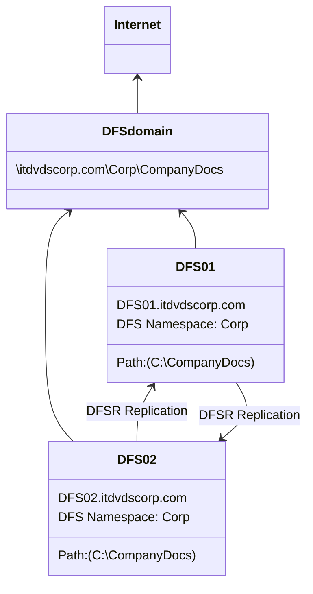

# Section 01 - Setting Up Share Drives
**#Before doing any DFS related operations, make sure you have already updated your OS to the latest version of Windows Server 2016.**

Otherwise, you may unable to search peer servers within your network, and you may encounter ***"Value does not fall within the expected range"* error**. This error is a bug that caused by `.NET Framework 4.7` installed on the OS.


# Distributed File System (DFS) by `itdvds.com`
Source: `https://www.youtube.com/watch?v=yDvbOsJIFpE`


There are two parts of **DFS** that can be used separately or together. 
- The first is the **namespace part**. That's where we create a namespace like `Corp`, which we're going to create. So that it's access via `\\[domain]\[namespace]`.
- Another part is the **DFS replication**, which we can use to replicate two folders that are on two different servers.

In this example, we're going to have a folder on a `C:` drive of both `DFS01` and `DFS02` called `CompanyDocs`. There is going to be replication that occurs, so that those two folders are always the same.

We're going to create a ***namespace*** called `Corp`, and create a ***folder target*** called `CompanyDocs`. So that when a user try to access `\\itdvdscorp.com\Corp\CompanyDocs`, then they'll hit either `DFS01` or `DFS02`, and have access to the `CompanyDocs` folder that will have documents inside of it that will being replicated, so that they're always the same.


## Add Server to Domain Network
Open **"Server Manager"** window, on the top right bar, click **"Manage"** -> **"Add Servers"** ->

-> on **"Add Servers"** window, under **"Active Directory"**, click **"Find Now"** button ->

-> you should a list of computers that joined your domain:
```
Name        Operating System
demodc      Windows Server 2016 Standard
user1       Windows 10 Professional
DFS01       Windows Server 2016 Standard
```
-> select `DFS01` -> **"|>"** -> **"OK"** ->

-> back to **"Server Manager"** window, you should see `DFS01` on the **"SERVERS"** list:
```
Server Name     IPv4 Address                Manageability                               Last Update
DEMODC          10.122.226.8,11.11.11.1     Online - Performance counters not started   ...
DFS01           11.11.11.22                 Online - Performance counters not started   ...
```


## Installing DFS Management Tools Features on Domain Controller
Open the **"Server Manager"** window, on top right menu bar, click **"Manage"** -> **"Add Roles and Features"** ->

-> continue the prompt until you reach **"Features"** section ->

-> on **"Features"** field, expand **"Remote Server Administration Tools"** ->

-> expand **"Remote Server Administration Tools"** -> expand **"Role Administration Tools"** ->

-> expand **"File Services Tools"** -> check **"DFS Management Tools"** checkbox ->

-> continue through the prompt until you finished


## Installing DFS Namespace & DFS Replication Roles on Server
Open the **"Server Manager"**, on ***left pane***, click **"All Servers"**. Then on **"SERVERS"** section of the ***main pane***, we have 3 servers listed as follow:
```
Server Name         IPv4 Address    Manageability                                   Last Updated
DFS01               192.168.6.207   Online - Pereformance counters not started      10/31/2017 9:...
DFS02               192.168.6.208   Online - Pereformance counters not started      10/31/2017 9:...
WIN-GMF0E73U8CH     192.168.6.210   Online - Pereformance counters not started      10/31/2017 9:...
```
First, we need to install **DFS** on **"DFS01"** and **"DFS02"**. Right-click `DFS01` on that main pane, then click **"Add Roles and Features"**.

On **"Add Roles and Features Wizard"** window, continue through the prompt until it reached **"Server Roles"** tab ->

-> On the "Roles" field, expand **"File and Storage Services (x of 12 installed)"** ->

-> expand **"File and iSCSI Services (x of 11 installed)"** ->

-> check both **"DFS Namespace"** and **"DFS Replication"** checkbox ->

-> continue through the prompt until it finished.


## Create Namespace
Let's create our `Corp` namespace. Open **"Server Manager"** window, on the top right menu, click **"Tools"** -> **"DFS Management"** ->

-> on the ***left pane*** of the **"DFS Management" MMC**, right-click **"Namespaces"** -> **"New Namespaces..."** ->

-> on the first page of the **"New Namespace Wizard"** window, enter **"DFS01"** in **"Server:"** field ->

-> on the **"Namespace Server"** tab, enter **"Corp"** in the **"Name:"** field, and leave the default permissions ->

-> on the **"Namespace Name and Settings"** tab, select **"Domain-based namespace"** option -> check "Enable Windows Server 2008 mode" ->

-> **"Preview of domain-based namespace:"** field should be `\\itdvdscorp.com\Corp` ->

-> Continue through the prompt until it finished.


## Add Namespace Server to Existing Namespace
Back to **"DFS Management" MMC**, on the left pane, expand the **"Namespaces"** -> **"`\\itdvdscorp.com\Corp`"** ->

-> right-click the same item -> **"Add Namespace Server..."** ->

-> on **"Add Namespace Server"** window, enter **"DFS02"** in the **"Namespace server:"** -> **"OK"**

On the **"Namespace Servers"** tab of the ***main pane*** of **"DFS Management" MMC** while `\\itdvdscorp.com\Corp` is highlighted on the ***left pane***, you should there are two namespace servers:
```
Type            Referral Status     Site        Path
(folder icon)   Enabled             Phoenix     \\DFS01.itdvdscorp.com
(folder icon)   Enabled             Phoenix     \\DFS02.itdvdscorp.com
```
We're going to add a folder target here. If we go to `DFS01`, we can see the path `\\dfs01\c$\CompanyDocs`.


## Create Share Folder
Back to **"DFS Management" MMC**, right-click `\\itdvdscorp.com\Corp` -> **"New Folder..."** ->

-> on the **"New Folder"** window, click **"Add..."** button ->

-> on the **"Add Folder Target"** window, click **"Browse..."** button ->

-> on the **"Browse for Shared Folders"** window, enter **"DFS01"** in **"Server:"** field -> **"Show Shared Folders"** button

-> on the **"Shared folders:"** field, it's not currently shared out, click on **"New Shared Folder..."** button ->

-> on the **"Create Share"** window, enter **"CompanyDocs"** in the **"Share name:"** field ->

-> **"Browse..."** button in the **"Local path of shared folder:"** field ->

-> on the **"Browse For Folder"** window, select the **"CompanyDocs"** folder:
```
DFS01
    c$
      > $RECYCLE.BIN
        CompanyDocs
            Forms
      > DFSRoots
      > Documents and Settigns (link)
        Perflogs
        ...
```
-> **"OK"** ->

-> Back to **"Create Share"** window, select **"All users have read and write permissions"** -> **"OK"**

-> Click **"OK"** close all the windows until it reach **"New Folder"** window -> enter **"CompanyDocs"** in the **"Name:"** ->

-> `\\itdvdscorp.com\Corp\CompanyDocs` should be seen in the **"Preview of namespace:"** field -> **"OK"**


Back to the ***left pane*** of the **"DFS Management" MMC**, expand `\\itdvdscorp.com\Corp`, you should see something like this:
```
DFS Management
    Namespaces
        \\itdvdscorp.com\Corp
            CompanyDocs (link)
        \\itdvdscorp.com\humanresources
  > Replication
```
Now we should be able to access the share folder on `DFS01` through `\\itdvdscorp.com\Corp\CompanyDocs`.


## Create Replication
Let's replicate this file over to `DFS02` and add `DFS02` as a folder target as well. We're going to create ***DFS Replication*** from `C:\CompanyDocs` on `DFS01` to `C:\CompanyDocs` on `DFS02`. The paths don't have to be exactly the same.

Let's right-click on **"`> Replication`"** on the ***left pane*** of the **"DFS Management" MMC** -> **"New Replication Group..."** ->

-> on the **"Replication Group Type"** tab of the **"New Replication Group Wizard"** window, select **"Multipurpose replication group"** ->

-> on the **"Name and Domain"** tab, enter **"CompanyDocs"** in the **"Name of replcation group:"** field, keep everything as default ->

-> on the **"Replication Group Members"** tab, click **"Add..."** button ->

-> on the **"Select Computers"** window, enter **"DFS01"** in the **"Enter the object names to select (examples):"** field -> **"OK"** ->

-> Back to the **"Replication Group Members"** tab, click **"Add..."** button again ->

-> on the **"Select Computers"** window, enter **"DFS02"** in the **"Enter the object names to select (examples):"** field -> **"OK"** ->

-> on the **"Replication Group Members"** tab, you should see something like this in the **"Members:"** field:
```
Server      Domain
DFS01       itdvdscorp.com
DFS02       itdvdscorp.com
```
-> on the **"Topology Selection"** tab, select **"Full mesh"** option ->

-> on the **"Replication Group Schedule and Bandwidth"** tab, select **"Replicate continuously using the specified bandwidth"** with **"Full"** option ->

-> on the **"Primary Member"** tab, select **"DFS01"** ->

-> on the **"Folders to Replicate"** tab, click **"Add..."** button ->

-> on the **"Add Folder to Replicate"** window, click **"Browse..."** ->

-> on the **"Browse For Folder"** tab, select **"CompanyDocs"** as below:
```
DFS01.itdvdscorp.com
    C$
      > $RECYCLE.BIN
        CompanyDocs         // select this
            Forms
      > DFSRoots
      > Documents and Settings (link)
      ...  
```
-> click **"OK"** or **"Next"** until it reach -> **"Local Path of CompanyDocs on Other Members"** tab ->

-> on **"Local Path of CompanyDocs on Other Members"** tab, click **"Edit..."** button ->

-> on **"Edit"** window, select **"Enabled"** -> **"Browse..."** button on **"Local path of folder:"** ->

-> on **"Browse For Folder"** window, we've not created a folder on `DFS02` yet, so click **"Make New Folder"** button ->

-> enter **"CompanyDocs"** -> **"OK"** ->

-> continue through the prompt until it finished

The replication group should be created successfully, we can check that by entering the path `\\dfs02\c$\CompanyDocs`, you should see all the files and folders from `\\dfs01\c$\CompanyDocs` should be replicated inside this folder. If we create a text file inside `\\dfs01\c$\CompanyDocs`, you should see this text file will be replicated to `\\dfs02\c$\CompanyDocs`.


## Create `DFS02` Folder Target 
Now we need to add `DFS02` as a ***folder target*** as well. So go back to the ***left pane*** of the **"DFS Management" MMC**:

click **"CompanyDocs"** link -> right-click the same item -> **"Add Folder Target..."** ->

-> on **"New Folder Target"** window, click **"Browse..."** in **"Path to folder target:"** field ->

-> on **"Browse for Shared Folders"** window, enter **"DFS02"** in the **"Server:"** field -> **"Show Shared Folders"** button ->

-> it's not currently share out, we need to create that, click **"New Shared Folder...**" ->

-> on **"Create Share"** window, enter **"CompanyDocs"** in **"Share name:"** field -> **"Browse..."** in **"Local path of shared folder:"** ->

-> on **"Browse For Folder"** window, select **"CompanyDocs"** like this:
```
DFS02
    c$
        CompanyDocs     // select this
            Forms
      > DFSRoots
        HRForms
        PerfLogs
        ...
```
-> **"OK"** ->

-> on **"Create Share"** window, select **"All users have read and write permissions"** option, same as `DFS01` -> **"OK"**

-> click **"OK"** to close all the windows ->

-> it may ask ***"Do you want to create a replication group?"***, click **"No"**


### Delete Shared Folders
Beware that you have to delete all the replication group and link through **"DFS Management" MMC** before you delete the shared folders for replication.


### Installing DFS Namespace & DFS Replication Roles through PowerShell
We could also do exactly the same thing in ***PowerShell***:
```
PS C:\Windows\system32> enter-pssession dfs01
[dfs01]: PS C:\Users\ssmith\Documents> Install-WindowsFeature FS-FileServer, FS-DFS-Namespace, FS-DFS-Replication -IncludeManagementTools
```
`pssession` means ***PowerShell session***.


# Creating Folder and Setting Up Share Drive by `MSFT`
To create a share drive that include the domain in the share drive path, you need to follow these steps:

1. Create a folder that is going to be the share drive.

2. Right-click on the folder and select **"Properties"** from the context menu.

3. Click on the **"Sharing"** tab in the **"Properties"** window.

4. Click the **"Advanced Sharing"** button.

5. Check the box next to **"Share this folder"** to enable sharing.

6. Enter a new share if needed.

7. Click the **"Permissions"** button.

8. Click the **"Add"** button to add the domain user or group that you want to grant access to the folder.

9. Click the **"Object Types"** button.

10. Check the **"Groups"** box and click **"OK"**.

11. Enter domain name followed by backslash () and the group name, for example, `DOMAIN\Group`, in the **"Enter the object names to select"** field.

12. Click **"Check Names"** to verify the enter domain group name.

13. Click **"OK"** to add the domain group to the share permissions list.

14. In the **"Permissions"** window, select the domain group you just added.

15. Choose the access level you want to grant to the selected domain group, such as **"Read"** or **"Full Control"**.

16. Click **"OK"** to apply the changes and close the **"Permissions"** window.

17. Click **"OK"** to apply the changes and close the **"Advanced Sharing"** window.

18. Close the **"Properties"** window.

The share drive path will now include the domain when accessed by the domain users, for example, `\\DOMAIN\ShareName`.


## Mapping Network Drive using Group Policy Preferences by `MSFT`
First of all, we need to create one **GPO**, and then we will define the settings. And after that, we will link that **GPO** to our **"HR" OU**.

Open **"Server Manage"** -> **"Tools"** (top right menu) -> **"Group Policy Management"** ->

On the ***left pane*** of the **Group Policy Managment MMC**, expand `mylab.local` -> expand **"Group Policy Objects"** -> 

-> right-click the same **"Group Policy Objects"** -> **"New"** ->

On the **"New GPO"** window, enter **"Map Network Drive Using Group Policy preference GPO"** to **"Name:"** field -> **"OK"**

The **GPO** should be created sucessfully under **"Group Policy Object" container**. Now we need to define the setting as well, so let's click on **"Map Network Drive Using Group Policy preference GPO"** -> right-click on the same item -> **"Edit..."**

On the ***left pane*** of the **"Group Policy Management Editor" MMC**, click on **"User Configuration"** -> 

-> expand **"Preferences"** -> expand **"Windows Settings"** -> **"Drive Maps"** ->

-> right-click on the same item -> **"New"** -> **"Mapped Drive"** ->

On the **"General"** tab of **"New Drive Properties"** window, under the **"Action:"** field, select **"Create"** becasue we're going to create a new map drive. Under the **"Location:"** field, we need to specify the path of our share folder, in our case, `\\WS2K19-DC01\HRSharedData`. Under the **"Label as:"** field, enter **"TEST"**. Under the **"Drive Letter"** section, select the drive letter **"M"** ->

Click on **"Common"** tab of **"New Drive Properties"** window, check the second checkbox that next to **"Run in logged-on user's security context (user policy option)"** ->

-> check the last checkbox that next to **"Item-level targeting"** -> **"Targeting..."** button ->

On the **"Targeting Editor"** window, click on **"New Item"**, here we have plenty of options. For the demonstration, we're going to use **"Security Group"** as a setting to define **Item-level targeting**, but here we have plenty of options that you can define the settings based on **"Operating System"**, or **"User"**, or **"IP Address Range"** and so on. Now on the top sub-window, here we can see **"the user is a member of the security group"**, then we need to define the name of the security group. Let's click on **"..."** button next to the **"Group:"** field.

On the **"Select Group"** window, click on **"Advanced"** button -> **"Find Now"** button. In **"Search result:"** field, all groups are available from **Active Directory**. Here we need to select **"HRUsers"**. Then click on **"OK"**.

Back to the **"Targeting Editor"** window, here you can see the **"the user is a member of the security group MYLAB\HRUsers"**. The policy will be applied to that user accounts, click on **"OK"**. Back to **"New Drive Properties"** window, click on **"Apply"** button, it'll be renamed to **"M: Properties"**, then click on **"OK"**.

Back to the ***main pane*** of the **"Group Policy Management Editor" MMC**, we'll see something like:
```
Drive Maps
    Name        Order   Action      Path                            Reconnect
    M:          1       Create      \\WS2K19-DC01\HRShare...        No
```
So we're successfully define the settings to create a map drive on a client computer. We've define the settings as well for **Item-level targeting**. Now we can close the **"Group Policy Management Editor" MMC**.

Now we can link our newly created **GPO**. Back to the ***left pane*** of **"Group Policy Management" MMC**, expand the **"MUMBAI"** folder:
```
Group Policy Management
    Forest: mylab.local
        Domains
            mylab.local
                Default Domain Policy (link)
              > Domain Controllers
                MUMBAI
                    HR              // right-click
                  > HRComputers
                  > TECH
                Group Policy Objects
                    Default Domain Controllers Policy
                    Default Domain Policy
                    Folder Redirection GPO
                    Map Network Drive Logon Script GPO
                    Map Network Drive Using Group Policy preferences GPO
                    Software Deployment Google Chrome GPO
              > WMI Filters
              > Starter GPOs
          > Sites
            Group Policy Modeling
            Group Policy Results
```
Let's right-click on **`HR` OU**, select **"Link an Existing GPO..."**. A **"Select GPO"** window popped up, on the **"Group Policy objects:"** field, select **"Map Network Drive Using Group Policy preferences GPO"**, then click **"OK"**. 

In the the **"HR"** on the ***left pane***, you should see something like this:
```
...
                MUMBAI
                    HR
                        Map Network Drive Using Group Policy preference GPO
                  > HRComputers
                  > TECH
...
```
Now we have successfully created a **GPO**, we've defined the setting, and then we've link the **GPO** to **"HR" OU** as well. Let's test the result. We're going to login as `hr.user1`. On **"This PC"** window, you should see the map drive called **"TEST (M:)"** with drive letter **"M:"** on the **"Network locations"** section. That means that policy successfully applied on our user.


