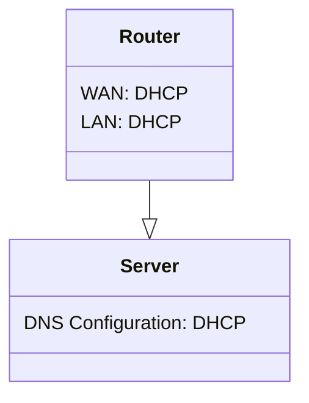

# Section 01 - Setup Window Server 2016


## Setting Up Fresh Router
Before installing Windows Server 2016 on a server, you need to set up a router that is used to connect to internet.

We're going to use ***ASUS RT-AC68U*** as the demo router in our case. At this moment, you just need to make sure the DNS configuration of the **WAN** part is getting from external DHCP server, and making sure that the DNS configuration of the **LAN** part is set to router built-in **DHCP**.



## Configuring Fresh Windows Server 2016
After the Windows Server 2016 is installed on a server, there are some steps you have to follow:


### 1. Connect Server to Router
We need to connect the server to the router because we need the internet to download the ***Edge*** web browser, activate the license key and synchronize the time for our server.


### 2. Activate Windows Server 2016 License Key
Click **"Windows"** icon -> **"Settings"** icon -> **"System"** (on ***Settings*** windows) ->

**"About"** (on ***Left pane*** of ***Settings*** window) -> **"Change product key or upgrade your edition of Windows"**

Enter the license key to finish the prompt.


- ### Unable to Change Product Key Error
1. Click **Start** and type **CMD** in the Start Search menu
2. **Right Click** and choose **Run as administrator**
3. To remove any existing product key (in case you used a trial key), enter and run the command `slmgr.vbs /upk`
4. Clear the product key from registry by running `slmgr.vbs /cpky`
5. To enter your new product key, use the command: `slmgr.vbs /ipk xxxxx-xxxxx-xxxxx-xxxxx` where the x’s are your actual product key
6. Lastly, activate Windows by entering the command `slmgr.vbs /ato`
7. Windows is now activated


### 3. Setup Correct Time, Time Zone and Region
Time must be synchronized between the client machine and the domain controller. If the client's clock is ahead of the domain controller's clock, it could cause authentication failures. Windows makes it mandatory to have a maximum time difference of five minutes between the domain controller and client.

To set up a correct time, here are the few steps you have to follow:

Click **"Windows"** icon -> **"Settings"** icon -> **"Time & language"** (on ***Settings*** windows) ->

- Click **"Region & language"** (on ***Left pane*** of ***Settings*** window). In the **"Windows and apps might use your country or region to give you local content"** field, select **"Hong Kong SAR"**

- Click **"Date & time"** (on ***Left pane*** of ***Settings*** window)

Follow the settings below:
```
Set time automatcially          On
Set time zone automatically     Off
...
Time zone
(UTC+8:00) Beijing, Chongqing, Hong Kong, Urumqi
```


### 4. Download Web Browser "*Edge*" through Internel Explorer


### 5. Rename Server
In **"Server Manager"** window, click **"Local Server"** (on ***Left pane***) -> ***value*** of **"Computer name"** field (on ***Main pane***) ->

**"Change..."** button (on **"System Properties"** window's **"Computer Name"** tab)

Fill the name you would like in the **"Computer name:"** field on the **"Computer Name/Domain Changes"** window. In our case, ***"demodc"***. It's going to prompt you to restart the system, so just do it. 


## Upgrade Windows Server 2022 Evaluation edition to Windows Server Standard edition

If your server is running an evaluation version of Windows Server Standard or Datacenter edition, you can convert it to an available retail version. Run the following commands in an elevated command prompt or PowerShell session.

1. Determine the current edition name by running the following command. The output is an abbreviated form of the edition name. For example, Windows Server Datacenter (Desktop Experience) Evaluation edition is `ServerDatacenterEval`.

#### Windows Command Prompt
```
DISM /online /Get-CurrentEdition
```

2. Verify which editions the current installation can be converted to by running the following command. From the output, make a note of the edition name you want to upgrade to.

#### Windows Command Prompt
```
DISM /online /Get-TargetEditions
```

3. Run the following command to save the Microsoft Software License Terms for Windows Server, which you can then review. Replace the <target edition> placeholder with the edition name you noted from the previous step.

#### Windows Command Prompt
```
DISM /online /Set-Edition:<target edition> /GetEula:C:\license.rtf
```

4. Enter the new edition name and corresponding retail product key in the following command. The upgrade process requires you to accept the Microsoft Software License Terms for Windows Server that you saved previously.

#### Windows Command Prompt
```
DISM /online /Set-Edition:<target edition> /ProductKey:<product key> /AcceptEula
```

For example:

#### Windows Command Prompt
```
DISM /online /Set-Edition:ServerDatacenter /ProductKey:ABCDE-12345-ABCDE-12345-ABCDE /AcceptEula
```

Reference: https://learn.microsoft.com/en-us/windows-server/get-started/upgrade-conversion-options

