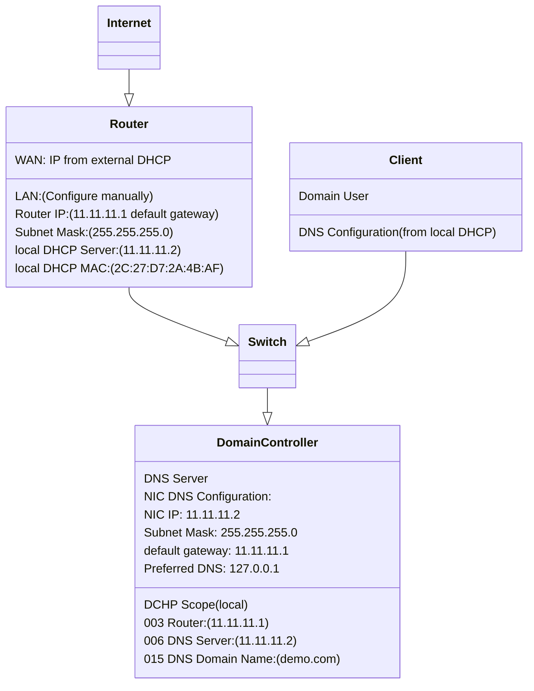

# Section 01 - Setup Window Server 2016 and Setup a Network

Here is the basic set up diagram for our demo network:

## Basic Setup of Router
Before installing Windows Server 2016 on a server, you need to set up a router that is used to connect to internet. This router is also needed to be set up correct DNS configuration for LAN.

