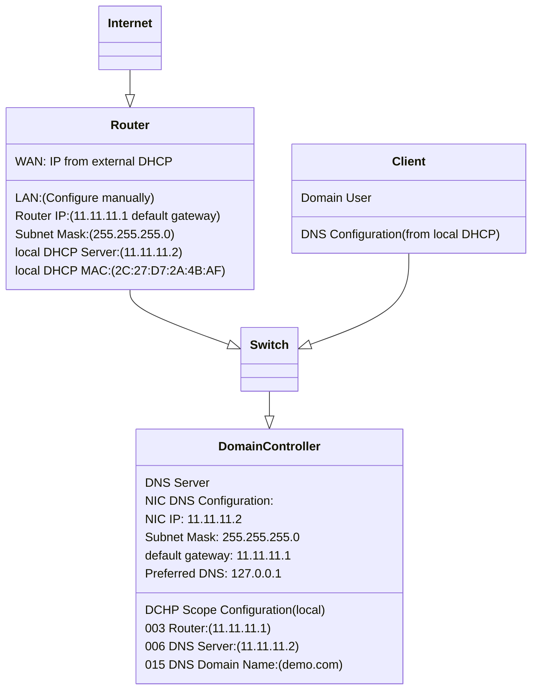

# Section 01 - Setup Window Server 2016 and Setup a Network
We're going to set up a network that ranged from `11.11.11.1` to `11.11.11.254` with a domain called `demo.com`.

Here is the basic set up diagram for our demo network with DNS configuration:



## Basic Setup of Router
Before installing Windows Server 2016 on a server, you need to set up a router that is used to connect to internet, because we need to download the ***Edge*** web browser, activate the license key and synchronize the time for our server.

We're going to use ***ASUS RT-AC68U*** as the demo router in our case. At this moment, you just need to make sure the DNS configuration of the **WAN** part is getting from external DHCP server, and making sure that the DNS configuration of the **LAN** part is set to router built-in **DHCP**.


## Configuring Windows Server 2016
After the Windows Server 2016 is installed on a server, there are some steps you have to follow:


### 1. Activate Windows Server 2016 License Key
Click **"Windows"** icon -> **"Settings"** icon -> **"System"** (on ***Settings*** windows) ->

**"About"** (on ***Left pane*** of ***Settings*** window) -> **"Change product key or upgrade your edition of Windows"**

Enter the license key to finish the prompt.


- ### Unable to Change Product Key Error
1. Click **Start** and type **CMD** in the Start Search menu
2. **Right Click** and choose **Run as administrator**
3. To remove any existing product key (in case you used a trial key), enter and run the command `slmgr.vbs /upk`
4. Clear the product key from registry by running `slmgr.vbs /cpky`
5. To enter your new product key, use the command: `slmgr.vbs /ipk xxxxx-xxxxx-xxxxx-xxxxx` where the x’s are your actual product key
6. Lastly, activate Windows by entering the command `slmgr.vbs /ato`
7. Windows is now activated


### 2. Setup Correct Time, Time Zone and Region
Click **"Windows"** icon -> **"Settings"** icon -> **"Time & language"** (on ***Settings*** windows) ->

- Click **"Region & language"** (on ***Left pane*** of ***Settings*** window). In the **"Windows and apps might use your country or region to give you local content"** field, select **"Hong Kong SAR"**

- Click **"Date & time"** (on ***Left pane*** of ***Settings*** window)

Follow the settings below:
```
Set time automatcially          On
Set time zone automatically     Off
...
Time zone
(UTC+8:00) Beijing, Chongqing, Hong Kong, Urumqi
```


### 3. Download Web Browser "*Edge*" through Internel Explorer


### 4. Rename Server
