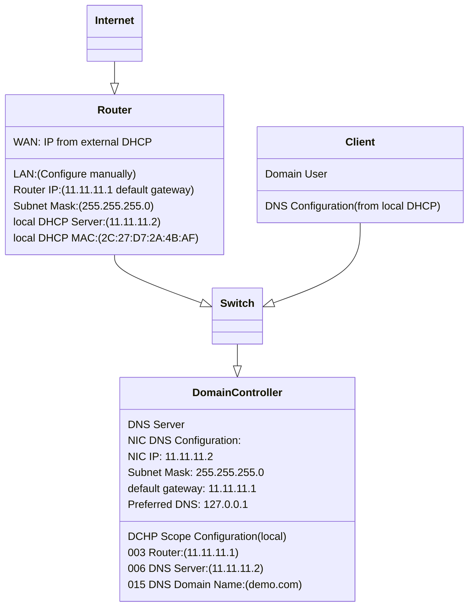

# Section 02 - Setup Network

We're going to set up a network that ranged from `11.11.11.1` to `11.11.11.254` with a domain called `demo.com`.

Here is the basic set up diagram for our `demo.com` network with DNS configuration:



## Setup Router DNS Configuration

- #### 1. Access Router Configuration Interface 
We need to set up **LAN** part of the router including IP address, subnet mask, default gateway. To do this, we need to access the router configuration interface through browser. By default, the IP address of ***ASUS RT-AC68U*** is `192.168.1.1`. So open the ***Edge*** browser, enter `192.168.1.1`.

- #### 2. Set Up Local Router IP & Subnet Mask
On the router interface, click **"LAN"**, then we need to set up the router IP address and subnet mask. In our case:
```
router IP:       11.11.11.1          // default gateway
subnet mask:     255.255.255.0
```

- #### 3. Turn Off Router DHCP 
On the router interface > **LAN** > **DHCP** section, turn off **"Enable DHCP Server"** option.

- #### 4. Setup External DHCP
We're going to set the IP address of this server to `11.11.11.2` and find out the MAC address of this server so that we can tell the router where is the external DHCP server.

To do this, we need to go back to the desktop of this server. Open the command prompt to get the MAC address of this server by running `getmac` command:
```
C:\Users\Administrator>getmac

Physical Address    Transport Name
=================== ==========================================================
60-32-B1-54-10-9E   \Device\Tcpip_{907F023E-2264-4F4D-906C-11E15C8B4657}
```
Back to the ***Edge*** browser window. On the router interface > **LAN** > **DHCP** section, enter both the DHCP server MAC address and IP address in the **manual DHCP server list**:
```
Mac address             IP address
60:32:B1:54:10:9E       11.11.11.2
```

- #### 5. Setup Server IP Address
Back to this server's desktop, open **"Server Manager"** window. Click the ***value*** of the **"Ethernet"** field ->

right-click **"Ethernet"** icon (on **"Network Connections"** window) -> click **"Properties"** ->

click **"Internet Protocol Version 4(TCP/IPv4)"** (on **"Ethernet Properties"** window) -> **"Properties"** button ->

Complete the DNS configuration (on **"Internet Protocol Version 4 (TCP/IPv4) Properties"** window) as follow:
```
- Use the following IP address:
    IP address:                 11.11.11.2
    Subnet mask:                255.255.255.0
    Default gateway:            11.11.11.1

-Use the following DNS server addresses:
    Preferred DNS server:       127.0.0.1
    Alternative DNS server:     [empty]
```

- #### 6. Add "Active Directory Domain Service" Role
So far, you cannot connect to the internet yet because this server cannot resolve its DNS server. So you need to add **"Active Directory Domain Service" (AD DS)** role to this server at first. Once this server added **AD DS** role, you could promote this to a domain controller and add **"DNS server"** role to this.

To add **"Active Directory Domain Service"** role, you need to open the **"Server Manager"** at first.

Click **"Manage"** (top right menu bar on **"Server Manager"** window) -> **"Add Roles and Features"** ->

**"Next"** (on **"Before you Begin"** tab of **"Add Roles and Features Wizard"** window) ->

**"Role-based or feature-basesd installation"** (**"Installation Type"** tab) ->

**"Select a server from the server pool"** (**"Server Selection"** tab) ->

check **"Active Directory Domain Services" checkbox** (**"Server Roles"** tab) -> 

leave remaining things as default and continue through the prompt until the end

- #### 7. Promote Server to Domain Controller & Add "DNS Server" Role

