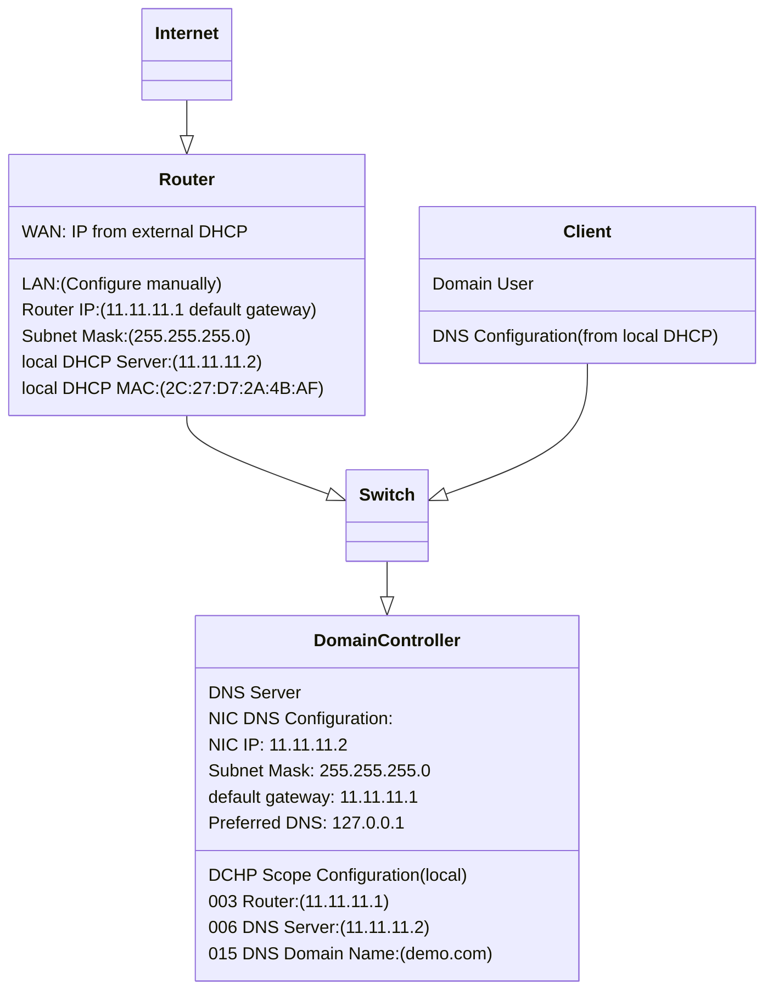

# Section 02 - Setup Network

We're going to set up a network that ranged from `11.11.11.1` to `11.11.11.254` with a domain called `demo.com`.

Here is the basic set up diagram for our `demo.com` network with DNS configuration:

