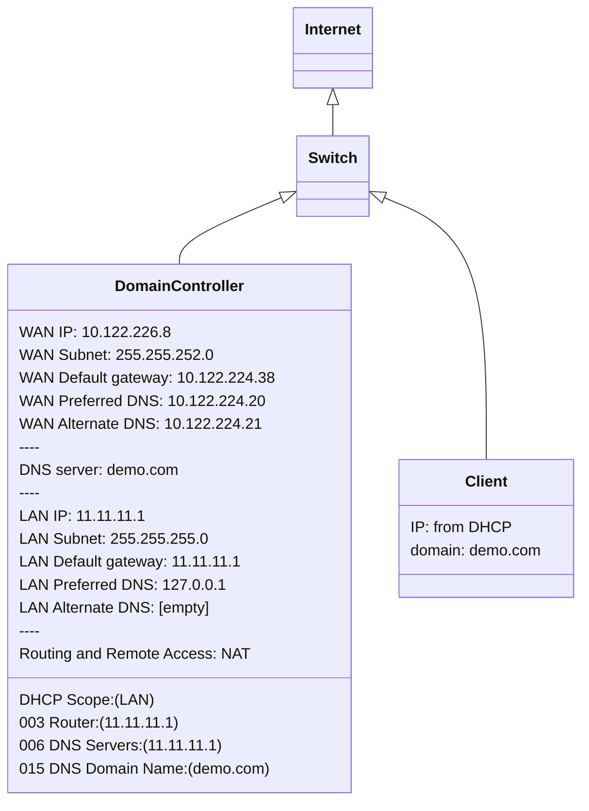

# Section 03 - Domain Controller Acting as Router
This is a guide about how build a **domain controller** that have **AD DS**, **DNS server**, **DHCP server** and **Router & remote access roles**. The main benefit of this setup is that you can direct remote access to the domain controller of inside domain although you are in outside domain. This setting is usually used for testing and learning purposes.


## Getting Started
We assume that you're starting on a fresh Windows Server 2016. Here are some steps you have to follow before adding the router role:

1. We need to install two **NICs** to your server. One **NIC** is for **LAN**, another **NIC** is for **WAN**.

2. Make sure that the **NIC** for **WAN** is getting **DNS configuration** from **external DHCP**, and then disable another **NIC** for **LAN**.

3. Add **Active Directory and Domain Service role** to the server.

4. Promote to **domain controller**, set up a new forest (i.e. `demo.com`) and add **DNS Server** role.


## Setting Up DNS Configuration for WAN & LAN NICs

Here is a diagram that showing how a domain controller, a client computer and a switch are connected together to create a network:



- ### Setting Up DNS Configuration on WAN NIC
Open **"Server Manager"**, click the value of the **"Ethernet"** field to change the DNS configuration of IPv4 as follow:
```
IP address:             10.122.226.8
Subnet mask:            255.255.252.0
Default gateway:        10.122.224.38

Preferred DNS server:   10.122.224.20
Alternate DNS server:   10.122.224.21
```
Then rename the NIC to **"WAN"**.


- ### Setting Up DNS Configuration on LAN NIC
Enable **LAN NIC** and set the DNS configuration of IPv4 as follow:
```
IP address:             11.11.11.1
Subnet mask:            255.255.255.0
Default gateway:        [empty]

Preferred DNS server:   127.0.0.1
Alternate DNS server:   [empty]
```


- ### Adding DHCP Server role to Server & Create New DHCP Scope Under IPv4
Open **"Server Manager"**, add the **DHCP Server** role to the server.

After the role is added, create a new DHCP scope under **"IPv4"** with following configuration:

Set up the **"Scope Name"** as follow:
```
Name:           IPv4 Scope
Description:    11.11.11.1 - 254
```
Set up the **"IP Address Range"** as follow:
```
Configuration settings for DHCP Server
    Enter the range of addresses that the scope distributes.
        Start IP address:   11.11.11.1
        End IP address:     11.11.11.254

Configuration settings that propagate to DHCP Client
        Length:             24              // auto filled
        Subnet mask:        255.255.255.0
```
Set up the **"Add Exclusions and Delay"** as follow:
```
Start IP address:       End IP address:
11.11.11.1              11.11.11.20
```
Leave the **"Lease Duration"** as default and that is **8 days**.


- ### Configuring DHCP Scope
Then configure the **DHCP Scope Options** under **"IPv4"** as follow:
```
[v] 003 Router                  IP address:     11.11.11.1
...
[v] 006 DNS Servers             IP address:     11.11.11.1
...
[v] 015 DNS Domain Name         String value:   demo.com
```


## Two Default Gateways Configured on Same Server
Here are the steps to set up a static route on Windows Server 2016:

#### 1. Open the Command Prompt as an administrator

#### 2. Enter the following command to view your current routing table:
```
route print
```
Here you can find all the information in `Active Routes` you need to add routes to your server:
```
C:\Users\Administrator>route print
===========================================================================
Interface List
  2...2c 27 d7 2a 4b af ......Intel(R) 82579LM Gigabit Network Connection
 12...60 32 b1 54 10 9e ......Realtek PCIe GbE Family Controller
...
===========================================================================

IPv4 Route Table
===========================================================================
Active Routes:
Network Destination        Netmask          Gateway       Interface  Metric
...
     10.122.224.0    255.255.252.0         On-link      10.122.226.8     21
...
       11.11.11.0    255.255.255.0         On-link        11.11.11.2     11
...
===========================================================================
Persistent Routes:
  Network Address          Netmask  Gateway Address  Metric
          0.0.0.0          0.0.0.0    10.122.224.38  Default
===========================================================================
...
```

#### 3. Identify the interface that connects to the LAN by looking at the network destination for the `0.0.0.0` route. It should list the IP address of the LAN interface.

#### 4. Determine the IP address of the router that connects to the WAN. You can obtain this information from the router's configuration settings.

#### 5. Enter the following command to add a route to the WAN network via the WAN NIC: (May Not Necessary?! to be clarify)
```
route add <WAN network> mask <netmask> <WAN NIC IP address> -p
```
For example, if the WAN network is `10.122.224.0/24`, the netmask is `255.255.252.0`, and the WAN NIC IP address is `10.122.226.8`, you would enter the following command:
```
route add 10.122.224.0 mask 255.255.252.0 10.122.226.8 -p
```

#### 6. Enter the following command to add a route to the LAN network via the LAN NIC:
```
route add <LAN network> mask <netmask> <LAN NIC IP address> -p
```
For example, if the LAN network is `11.11.11.0/24`, the netmask is `255.255.255.0`, and the LAN NIC IP address is `11.11.11.2`, you would enter the following command:
```
route add 11.11.11.0 mask 255.255.255.0 11.11.11.2 -p
```
Note that the `-p` flag is used to make the route permanent, so that it survives a reboot.

#### 7. Verify that the new routes have been added by entering the following command:
```
route print
```
You should see the two new routes (in `Persistent Routes:`) listed in the routing table:
```
C:\Users\Administrator>route print
...
===========================================================================
Persistent Routes:
  Network Address          Netmask  Gateway Address  Metric
     10.122.224.0    255.255.252.0     10.122.226.8       1
       11.11.11.0    255.255.255.0       11.11.11.2       1
===========================================================================
...
```

By setting up static routes in this way, you can ensure that traffic is correctly routed between the LAN and WAN networks, without the need for multiple default gateways on the same machine.

- ### Check Default Gateway on WAN DNS Configuration
After setting up a static route, the value of default gateway on **WAN NIC** may become **empty**. If it happened, you have to enter the **IPv4** default gateway indicating the external router again (i.e. `10.122.224.38`).

Open the command prompt, and run `route print`, you should a new gateway address 
```
0.0.0.0          0.0.0.0    10.122.224.38  Default
```
